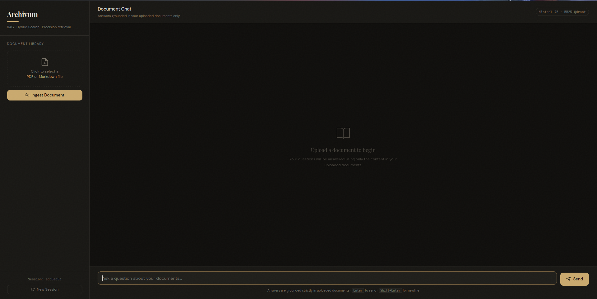
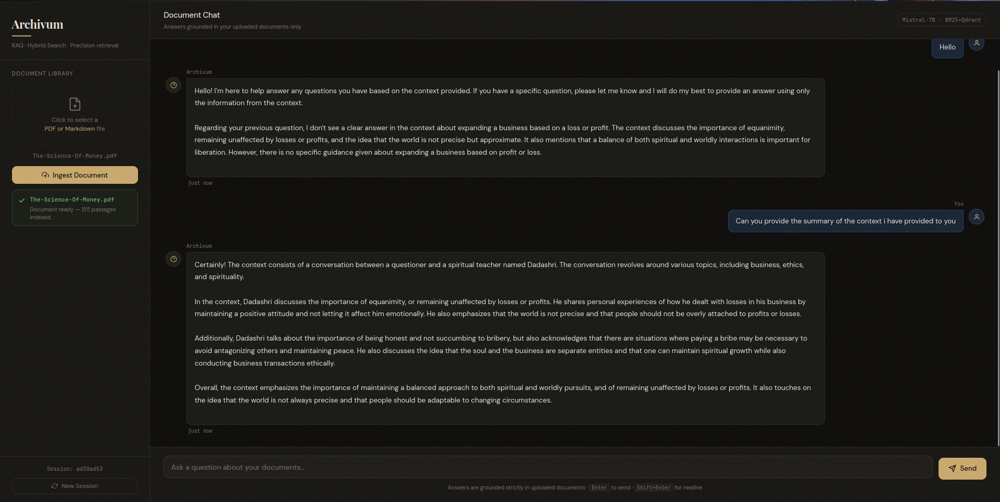

# Cognita

**Local-first RAG (Retrieval-Augmented Generation) chat interface.**

Upload a PDF or Markdown document and ask questions about it. Answers are grounded strictly in the content you provide — the model cannot draw on outside knowledge. Everything except the LLM inference call runs entirely on your machine.

---

## What it does

1. You upload a document through the sidebar.
2. The system splits it into overlapping text chunks, embeds each chunk using a local sentence-transformer model, and indexes them in a local Qdrant vector database alongside a BM25 keyword index.
3. When you ask a question, both indexes are searched in parallel, the results are fused with Reciprocal Rank Fusion, the top candidates are reranked with a cross-encoder, and the final context passages are sent to a Hugging Face-hosted LLM.
4. The LLM is instructed to answer only from the retrieved passages. If the answer is not in your document, it says so.

---

## Application Preview

### Before Document Ingestion
The system interface before loading documents into the vector store.



### After Document Ingestion
The interface after documents are processed and embeddings are generated.



---

## Architecture

```
Browser (HTMX — no JS framework)
        │
        │  HTTP
        ▼
  ┌─────────────┐
  │  FastAPI     │  app.py
  │  (Uvicorn)   │
  └──────┬──────┘
         │
    ┌────┴─────────────────────────────┐
    │                                  │
    ▼                                  ▼
┌─────────────┐               ┌──────────────────┐
│  ingestion  │               │    retrieval      │
│  .py        │               │    .py            │
│             │               │                   │
│ pdfplumber  │               │  Qdrant (local)   │
│ + OCR       │──── chunks ──▶│  all-MiniLM-L6-v2 │
│ fallback    │               │  BM25Okapi        │
└─────────────┘               │  RRF fusion       │
                              └────────┬──────────┘
                                       │ top-15 candidates
                                       ▼
                              ┌──────────────────┐
                              │  reranker.py      │
                              │  FlashRank        │
                              │  cross-encoder    │
                              └────────┬──────────┘
                                       │ top-5 passages
                                       ▼
                              ┌──────────────────┐
                              │  generator.py     │
                              │  HF Inference API │
                              │  Mistral-7B       │
                              └────────┬──────────┘
                                       │ answer
                                       ▼
                              ┌──────────────────┐
                              │  memory.py        │
                              │  JSON session     │
                              │  history (3 turns)│
                              └──────────────────┘
```

---

## Project structure

```
archivum/
├── app.py                          # FastAPI server — all routes
├── requirements.txt                
│
├── src/
│   ├── ingestion.py                # PDF/Markdown parsing, chunking, OCR fallback
│   ├── retrieval.py                # Qdrant vector search + BM25, RRF fusion
│   ├── reranker.py                 # FlashRank cross-encoder reranking
│   ├── generator.py                # HF InferenceClient, retry logic, prompting
│   └── memory.py                   # JSON session persistence, turn history
│
├── templates/
│   ├── base.html                   # Layout, CSS design tokens, HTMX, Tailwind
│   ├── index.html                  # Two-panel UI (sidebar + chat)
│   └── components/
│       ├── ai_message.html         # AI response bubble fragment
│       └── upload_status.html      # Upload success / error badge fragment
│
├── static/                         # Self-hosted assets
│   ├── js/htmx.min.js
│   ├── css/tailwind.min.css
│   └── css/fonts.css
```

---

## Tech stack

| Layer | Technology | License |
|---|---|---|
| Web framework | [FastAPI](https://fastapi.tiangolo.com) | MIT |
| ASGI server | [Uvicorn](https://www.uvicorn.org) + [Gunicorn](https://gunicorn.org) | BSD |
| Frontend | [HTMX](https://htmx.org) + [Tailwind CSS](https://tailwindcss.com) | BSD / MIT |
| PDF extraction | [pdfplumber](https://github.com/jsvine/pdfplumber) | MIT |
| OCR fallback | [Tesseract](https://github.com/tesseract-ocr/tesseract) + [pytesseract](https://github.com/madmaze/pytesseract) + [pdf2image](https://github.com/Belval/pdf2image) | Apache 2 / MIT / MIT |
| Embeddings | [sentence-transformers](https://www.sbert.net) `all-MiniLM-L6-v2` | Apache 2 |
| Vector store | [Qdrant](https://qdrant.tech) (local disk mode) | Apache 2 |
| Keyword search | [rank-bm25](https://github.com/dorianbrown/rank_bm25) | Apache 2 |
| Reranker | [FlashRank](https://github.com/PrithivirajDamodaran/FlashRank) | Apache 2 |
| LLM inference | [Hugging Face Inference API](https://huggingface.co/inference-api) — Mistral-7B-Instruct-v0.2 | API (free tier) |
| Templating | [Jinja2](https://jinja.palletsprojects.com) | BSD |

Everything except the HF Inference API call runs locally. No data is sent to any third party except the text passages sent to the HF API during generation.

---

## Requirements

- Python 3.11 or 3.12
- A free [Hugging Face](https://huggingface.co) account and API token
- For OCR support on scanned PDFs: `tesseract-ocr` and `poppler-utils` system packages

---

## Local setup

### 1. Clone and create a virtual environment

```bash
git clone https://github.com/your-username/archivum.git
cd archivum

python3.11 -m venv .venv
source .venv/bin/activate          # Windows: .venv\Scripts\activate
```

### 2. Install dependencies

```bash
pip install --upgrade pip
pip install -r requirements.txt
```

For OCR support on scanned PDFs (optional but recommended):

```bash
pip install pdf2image pytesseract

# Ubuntu / Debian
sudo apt install tesseract-ocr poppler-utils

# macOS
brew install tesseract poppler
```

### 3. Self-host static assets

The app loads HTMX, Tailwind, and fonts from CDNs by default. For a reliable deployment these should be downloaded locally.

```bash
mkdir -p static/js static/css static/fonts

# HTMX
curl -o static/js/htmx.min.js \
  https://unpkg.com/htmx.org@1.9.12/dist/htmx.min.js

# Tailwind standalone CLI (no Node.js required)
# Download from https://github.com/tailwindlabs/tailwindcss/releases/latest
# then run:
./tailwindcss -i /dev/null -o static/css/tailwind.min.css \
  --minify --content "templates/**/*.html"

# Fonts — download the woff2 files listed at:
# https://fonts.googleapis.com/css2?family=Playfair+Display:ital,wght@0,500;0,700;1,500
#   &family=DM+Sans:wght@300;400;500&family=JetBrains+Mono:wght@400;500
# Place them in static/fonts/ and write a @font-face stylesheet at
# static/css/fonts.css pointing to them.
```

Then update `base.html` to reference local paths:

```html
<script src="/static/js/htmx.min.js" defer></script>
<link  rel="stylesheet" href="/static/css/tailwind.min.css" />
<link  rel="stylesheet" href="/static/css/fonts.css" />
```

### 4. Set your Hugging Face token

```bash
cp .env.example .env
# Edit .env and set:
# HF_TOKEN=hf_your_token_here
```

`.env` is listed in `.gitignore` and is never committed.

### 5. Run the development server

```bash
uvicorn app:app --reload --host 127.0.0.1 --port 8000
```

Open **http://localhost:8000** in your browser.

---

## How to use

1. **Upload a document** — click the drop zone in the left sidebar and select a PDF or Markdown file (up to 50 MB). Click *Ingest Document*. A green badge confirms when indexing is complete and shows how many passages were extracted.

2. **Ask a question** — type in the chat box and press `Enter` to send. `Shift+Enter` inserts a newline. The AI will answer using only the passages from your document.

3. **Start a new session** — click *New Session* at the bottom of the sidebar. This clears the chat history, wipes all indexed documents from the vector store, and resets the session ID. You must re-upload documents in the new session.

4. **Refresh the page** — treated the same as starting a new session. Documents from the previous page load are not accessible.

---

## How HTMX wires the UI together

There is no JavaScript framework. HTMX attributes on HTML elements make the three requests and swap the returned HTML fragments into the DOM without a page reload.

| User action | HTMX fires | Server endpoint | Fragment returned |
|---|---|---|---|
| Click *Ingest Document* | `POST /upload` | `/upload` | `upload_status.html` badge appended to `#upload-status` |
| Press Enter / click *Send* | `POST /chat` | `/chat` | `ai_message.html` bubble inserted before `#thinking-indicator` |
| Click *New Session* | `POST /session/new` | `/session/new` | JSON `{"session_id": "..."}` — client JS handles all DOM resets |

The user message bubble is rendered **instantly client-side** (cloned from a `<template>` element) before the HTMX request fires, so there is zero perceived latency between sending and seeing your message appear.

---

## API reference

| Method | Path | Auth | Description |
|---|---|---|---|
| `GET` | `/` | None | Renders `index.html`. Generates a fresh `session_id`. Clears the vector store. |
| `POST` | `/upload` | None | Saves and ingests a document. Form fields: `file` (multipart), `session_id`. Returns an HTML fragment. |
| `POST` | `/chat` | None | Runs the RAG pipeline. Form fields: `user_input`, `session_id`. Returns an HTML fragment. |
| `POST` | `/session/new` | None | Clears the vector store and returns `{"session_id": "new-id"}`. |
| `GET` | `/health` | None | Returns `{"status": "ok", "timestamp": ..., "indexed_session": ...}`. |

---

## Configuration

All tunables live at the top of their respective files. The most commonly changed values:

| File | Variable | Default | Description |
|---|---|---|---|
| `app.py` | `MAX_UPLOAD_BYTES` | `52428800` (50 MB) | Hard limit on upload size |
| `app.py` | `MAX_QUERY_CHARS` | `2000` | Query length cap before processing |
| `app.py` | `MAX_CHARS_PER_CHUNK` | `1500` | Max chars sent per passage to the LLM |
| `retrieval.py` | `EMBEDDING_MODEL` | `all-MiniLM-L6-v2` | Sentence-transformer model for embeddings |
| `retrieval.py` | `RRF_K` | `60` | Reciprocal Rank Fusion smoothing constant |
| `generator.py` | `DEFAULT_MODEL` | `mistralai/Mistral-7B-Instruct-v0.2` | HF model used for generation |
| `generator.py` | `GenerationConfig.max_new_tokens` | `512` | Maximum tokens in the LLM response |
| `generator.py` | `GenerationConfig.temperature` | `0.1` | Lower = more deterministic answers |
| `memory.py` | `MAX_STORED_TURNS` | `200` | Max turns persisted per session JSON file |
| `app.py` (via `get_session`) | `history_turns` | `3` | Prior exchanges injected into each prompt |
| `ingestion.py` | `chunk_size` | `512` words | Words per chunk |
| `ingestion.py` | `overlap` | `64` words | Word overlap between adjacent chunks |

---

## License

MIT — see `LICENSE`.

---

## Acknowledgements

- [Qdrant](https://qdrant.tech) for the local vector store
- [sentence-transformers](https://www.sbert.net) for the `all-MiniLM-L6-v2` embedding model
- [FlashRank](https://github.com/PrithivirajDamodaran/FlashRank) for fast cross-encoder reranking
- [Mistral AI](https://mistral.ai) for the Mistral-7B-Instruct model hosted on Hugging Face
- [HTMX](https://htmx.org) for making server-rendered interactivity simple
